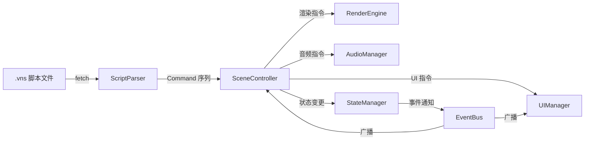

# Web 视觉小说引擎
> **项目名称**: Web Visual Novel Engine  
> **汇报日期**: 2026-03-31  
> **演示项目**: 《红楼职场梦》— 当红楼梦人物穿越到现代互联网公司  

---

## 一、项目概述

### 1.1 什么是视觉小说？

视觉小说（Visual Novel）是一种以**文字叙事**为核心、结合**角色立绘、背景插画、音乐音效和玩家选择**的互动叙事游戏类型。代表作品包括《Fate/stay night》《CLANNAD》《Steins;Gate》等。

### 1.2 项目目标

构建一个**完全基于 Web 技术**的视觉小说引擎，实现：

| 目标 | 说明 |
|------|------|
| 🌐 **纯浏览器运行** | 无需安装任何插件，打开网页即玩 |
| 📝 **策划友好** | 非程序员（编剧、美术）可通过简单脚本创作完整作品 |
| 📦 **静态部署** | 构建产物为纯静态文件，可部署到 GitHub Pages / Vercel / Nginx |
| 🔌 **可扩展** | 插件架构，支持自定义小游戏、数值系统等扩展 |
| 📱 **跨平台** | 桌面浏览器 + 移动端浏览器 + 可封装为桌面应用 |

---

## 二、技术栈

```
┌──────────────────────────────────────────┐
│              技术选型一览                  │
├──────────────┬───────────────────────────┤
│ 开发语言      │ TypeScript               │
│ 构建工具      │ Vite 5                   │
│ 渲染方案      │ DOM + CSS（轻量高效）      │
│ 音频引擎      │ Howler.js                │
│ 图形库（预留） │ PixiJS 7（可选扩展）      │
│ 部署方案      │ GitHub Pages + CI/CD     │
│ 包管理        │ npm                      │
└──────────────┴───────────────────────────┘
```

**为什么选择 DOM + CSS 而非 Canvas？**
- 文字排版天然支持 CJK（中日韩）字体渲染
- CSS 动画/过渡性能优秀，GPU 加速
- 无障碍访问（Accessibility）友好
- 开发调试方便（浏览器 DevTools 直接审查元素）
- PixiJS 作为预留方案，用于未来的粒子特效、Shader 等高级需求

---

## 三、引擎架构

### 3.1 整体架构图

```
┌─────────────────────────────────────────────────────┐
│                   VNEngine (主入口)                   │
│              初始化所有子系统，提供公共 API              │
├──────────┬──────────┬──────────┬────────────────────┤
│  Script  │  Render  │  Audio   │   State Manager    │
│  Parser  │  Engine  │  Manager │  (变量/存档/设置)    │
├──────────┴──────────┴──────────┴────────────────────┤
│                  Scene Controller                    │
│           (场景调度器，逐行执行脚本命令)                │
├─────────────────────────────────────────────────────┤
│              Asset Manager & Loader                  │
│           (资源发现、加载、缓存、预加载)                │
├─────────────────────────────────────────────────────┤
│            Plugin System / Event Bus                 │
│              (事件驱动 + 插件扩展)                     │
├─────────────────────────────────────────────────────┤
│         UI Manager │ Save/Load │ Settings │ Gallery  │
└─────────────────────────────────────────────────────┘
```

### 3.2 模块职责

| 模块 | 文件 | 代码量 | 职责 |
|------|------|--------|------|
| **VNEngine** | `index.ts` | ~350行 | 引擎主入口，初始化所有子系统，标题画面，公共 API |
| **ScriptParser** | `ScriptParser.ts` | ~500行 | 解析 `.vns` 脚本为内部命令序列 |
| **SceneController** | `SceneController.ts` | ~700行 | 场景调度核心，逐行执行命令，处理分支/跳转/条件 |
| **RenderEngine** | `RenderEngine.ts` | ~730行 | 视觉渲染：背景、角色立绘、转场、天气、特效 |
| **UIManager** | `UIManager.ts` | ~900行 | UI 系统：对话框、选项、存档界面、设置面板 |
| **AudioManager** | `AudioManager.ts` | ~250行 | 音频：BGM/BGS/SFX/Voice 多通道管理 |
| **StateManager** | `StateManager.ts` | ~400行 | 状态：变量、存档、设置、画廊、成就 |
| **AssetManager** | `AssetManager.ts` | ~150行 | 资源路径解析与清单管理 |
| **EventBus** | `EventBus.ts` | ~50行 | 发布-订阅事件总线 |
| **Types** | `types.ts` | ~510行 | 全局类型定义（35+ 命令类型） |

**总代码量**: 约 **4,500+ 行** TypeScript

### 3.3 数据流



---

## 四、核心功能详解

### 4.1 自定义脚本语言 (VNS)

引擎设计了一套**人类可读**的领域特定语言（DSL），策划/编剧无需编程知识即可编写：

```vns
# 章节标题卡
[chapter "第一回" subtitle="荣国府科技有限公司" duration=4000]

# 背景切换 + 转场效果
[bg office_lobby with fade duration=1000]

# 背景音乐 + 环境音
[bgm main_theme]
[bgs office_ambience volume=0.3]

# 角色登场
[show xifeng at center with fade]

# 带表情的对话
xifeng(scheming): "哟！这不是宝兄弟嘛！"

# 旁白
: 荣国府科技有限公司——一家号称"百年老字号"的互联网创业公司。

# 屏幕震动
[shake screen intensity=3 duration=300]

# 玩家选择分支
[choice]
  "好的林工！我一定好好学！" -> choice_formal
  "可是叫林妹妹更亲切嘛~" -> choice_casual
[/choice]

# 变量操作 + 条件判断
[set daiyu_affection += 3]
[if daiyu_affection >= 50]
  daiyu(happy): "你还不错嘛。"
[else]
  daiyu(cold): "哼。"
[/if]
```

**支持的命令类型（35种）**：

| 类别 | 命令 |
|------|------|
| **叙事** | `dialogue` `narrator` `monologue` `input` |
| **角色** | `show` `hide` `expression` `move` |
| **场景** | `bg` `scene` `fade` `camera` `cinematic` |
| **音频** | `bgm` `bgs` `sfx` `voice` `stop` |
| **流程** | `choice` `jump` `label` `if/elif/else/endif` `wait` `end` |
| **特效** | `shake` `flash` `weather` `chapter` |
| **系统** | `set` `achievement` `video` `parallel` `timed` |

### 4.2 渲染系统

```
图层结构 (从底到顶):
├── 🖼️ Background Layer    — 全屏背景图 + 平滑转场
├── 👤 Character Layer     — 角色立绘（支持 5+ 同屏）
├── 🌧️ FX Layer           — 天气粒子 / 屏幕特效
├── 💬 UI Layer            — 对话框 / 选项 / 菜单
└── 🔔 System Layer        — 通知 / 存档界面
```

**关键特性**：
- **背景预加载**：切换背景前先预加载图片，避免黑屏闪烁
- **角色立绘 Fallback**：当指定表情图片不存在时，自动回退到 `normal` 表情
- **平滑转场**：支持 `fade` / `dissolve` / `slide` / `zoom` 等 12 种转场效果
- **天气系统**：雨、雪、雾、樱花、萤火虫粒子效果
- **屏幕特效**：震动、闪白、暗角、模糊、色彩滤镜

### 4.3 音频系统

基于 Howler.js 实现的多通道音频管理：

| 通道 | 用途 | 特性 |
|------|------|------|
| **BGM** | 背景音乐 | 循环播放，交叉淡入淡出 |
| **BGS** | 环境音效 | 可叠加（雨声 + 风声） |
| **SFX** | 音效 | 单次播放，可重叠 |
| **Voice** | 角色语音 | 每次一条，推进时停止 |

### 4.4 存档系统

- **20+ 存档槽位** + 自动存档
- 存档数据包含：场景位置、所有变量、角色状态、对话历史、截图缩略图
- 存储后端：`localStorage`（默认）/ `IndexedDB`（大数据量）
- 支持导出/导入 JSON 文件

### 4.5 快进 & 回看

- **快进模式**：已读文本 50ms 推进，未读文本 200ms 推进
- **自动播放**：可调节速度的自动推进
- **文本历史**：可滚动回看所有对话记录

### 4.6 设置系统

| 设置项 | 类型 | 说明 |
|--------|------|------|
| 文字速度 | 滑块 | 每秒字符数 (1-100, 瞬间) |
| 自动速度 | 滑块 | 自动推进延迟 (0.5s-10s) |
| BGM/SFX/Voice 音量 | 滑块 | 独立音量控制 |
| 快进模式 | 单选 | 仅已读 / 全部 |
| 全屏 | 开关 | 浏览器全屏 |
| 字体大小 | 滑块 | 文字缩放 |
| 对话框透明度 | 滑块 | 0-100% |

---

## 五、演示项目：《红楼职场梦》

### 5.1 创意概念

> 当《红楼梦》人物穿越到现代互联网公司会发生什么？

一部**职场搞笑视觉小说**，将经典文学角色置于现代科技公司场景中，产生荒诞喜剧效果。

### 5.2 角色设定

| 角色 | 职位 | 性格特点 | 立绘表情数 |
|------|------|----------|-----------|
| 🔴 **贾宝玉** | 初级前端开发 | 慵懒、天真、不谙世事 | 9 种 |
| 🟣 **林黛玉** | 高级前端工程师 | 清冷、毒舌、代码洁癖 | 8 种 |
| 🟡 **薛宝钗** | 产品总监 | 端庄、知性、需求文档500页 | 8 种 |
| 🔴 **王熙凤** | 运营副总裁 | 精明、霸气、铁腕管理 | 11 种 |
| ⚫ **贾政** | CEO | 威严、古板、不怒自威 | 5 种 |
| 🟢 **刘姥姥** | 天使投资人 | 朴实、好奇、精神矍铄 | 7 种 |
| 🟢 **妙玉** | 高级后端工程师 | 清高、脱俗、代码洁癖Pro | 5 种 |

### 5.3 章节结构

```
第一回 · 荣国府科技有限公司
  ├── 场景1: 新人入职（认识凤姐、黛玉、宝钗）
  └── 场景2: 第一天工作

第二回 · 刘姥姥参观数据中心
  ├── 场景1: 投资人来访
  └── 场景2: 参观机房

第三回 · 大观园团建风云
  ├── 场景1: 团建策划
  └── 场景2: 团建活动

第四回 · 年终述职大会
  └── 场景1: 述职 + 多结局
```

### 5.4 美术风格

- **古风 × 二次元**：传统中国色彩 + 日系赛璐璐画风
- **背景**：11 张场景图（办公大厅、会议室、机房、天台等）
- **立绘**：7 个角色 × 多表情，透明背景 PNG
- **AI 辅助生成**：使用 AI 绘图工具 + 统一风格 Prompt 生成

### 5.5 场景背景一览

| 场景 | 说明 |
|------|------|
| `office_lobby` | 融合古风的现代公司大厅 |
| `office_open` | 开放式办公区 |
| `meeting_room` | 会议室 |
| `ceo_office` | CEO 办公室 |
| `pantry` | 中式茶水间 |
| `server_room` | 服务器机房 |
| `rooftop` | 天台（夕阳） |
| `park` | 大观园主题公园 |
| `restaurant` | 公司食堂 |
| `conference_hall` | 年终述职大厅 |
| `title_bg` | 标题画面 |

---

## 六、部署方案

### 6.1 构建流程

```bash
npm run build    # TypeScript 编译 + Vite 打包优化
```

产出纯静态文件：
```
dist/
├── index.html          # 入口
├── assets/             # JS/CSS 打包产物
├── game/               # 游戏脚本 + 配置
└── assets/images/...   # 图片/音频资源
```

### 6.2 GitHub Pages 自动部署

已配置 GitHub Actions CI/CD：

```
push to main → 自动构建 → 部署到 GitHub Pages
```

访问地址：`https://<username>.github.io/RedMasionsCompany/`

---

## 七、项目亮点与创新点

### 7.1 技术亮点

1. **纯前端架构**：零服务器依赖，静态文件即可运行完整游戏
2. **自定义 DSL**：设计了 35 种命令类型的脚本语言，策划可直接编写
3. **模块化引擎**：8 大子系统通过 EventBus 解耦通信，职责清晰
4. **智能 Fallback**：图片加载失败自动回退、背景预加载防黑屏
5. **完整的游戏循环**：标题画面 → 游戏 → 存档/读档 → 设置 → 画廊

### 7.2 工程亮点

1. **TypeScript 全栈**：完整类型定义（510 行类型文件），编译期错误检查
2. **Vite 构建**：毫秒级热更新，Tree-shaking 优化产物体积
3. **CI/CD 自动化**：push 即部署，零运维成本
4. **约定优于配置**：资源按文件夹约定自动注册，减少手动配置

### 7.3 创意亮点

1. **经典文学 × 现代职场**：红楼梦人物穿越到互联网公司的荒诞喜剧
2. **AI 辅助美术**：统一 Prompt 体系生成一致风格的角色立绘和场景背景
3. **互动叙事**：玩家选择影响角色好感度，导向不同结局

---

## 八、后续规划

| 优先级 | 功能 | 说明 |
|--------|------|------|
| 🔴 高 | 更多章节内容 | 完善剧情，增加更多分支和结局 |
| 🔴 高 | 移动端适配 | 触屏操作优化，响应式布局 |
| 🟡 中 | 音频资源 | 添加 BGM、音效、环境音 |
| 🟡 中 | CG 画廊 | 解锁制 CG 查看器 |
| 🟢 低 | Live2D 支持 | 角色动态立绘 |
| 🟢 低 | 可视化编辑器 | 拖拽式场景编辑工具 |
| 🟢 低 | 插件市场 | 小游戏、数值系统等扩展插件 |

---

## 九、总结

本项目实现了一个**功能完整的 Web 视觉小说引擎**，涵盖了从脚本解析、渲染显示、音频管理到存档系统的全链路功能。通过自定义 DSL 脚本语言降低了创作门槛，通过纯静态部署方案实现了零运维成本。

演示项目《红楼职场梦》验证了引擎的实际可用性，展示了引擎在角色管理、分支叙事、转场特效等方面的能力。

**一句话总结**：用 Web 技术让每个人都能讲好自己的故事。

---

> 📎 **项目仓库**: [RedMasionsCompany](https://github.com/xxx/RedMasionsCompany)  
> 🎮 **在线演示**: [GitHub Pages](https://<username>.github.io/RedMasionsCompany/)  
> 📄 **需求文档**: `docs/requirements.md` (1144 行)
